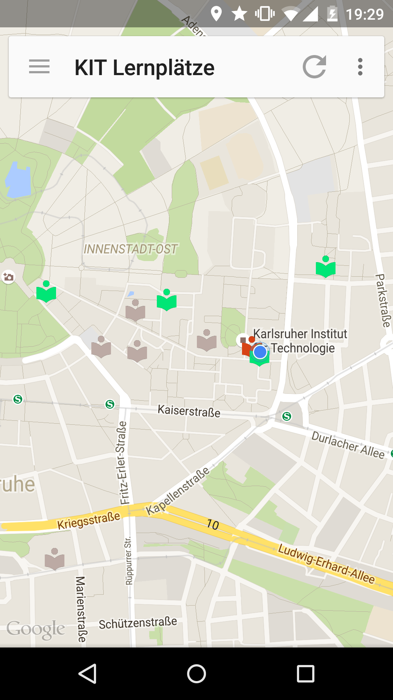
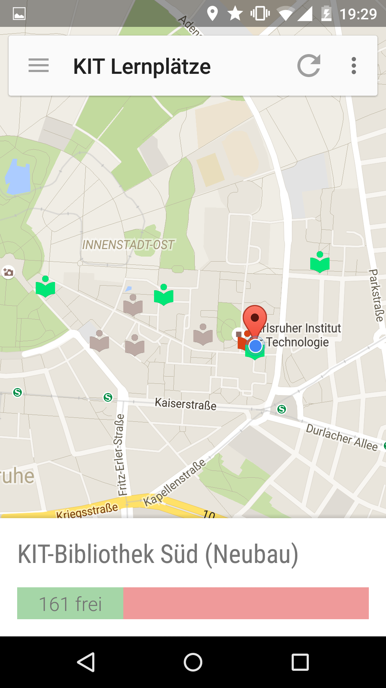
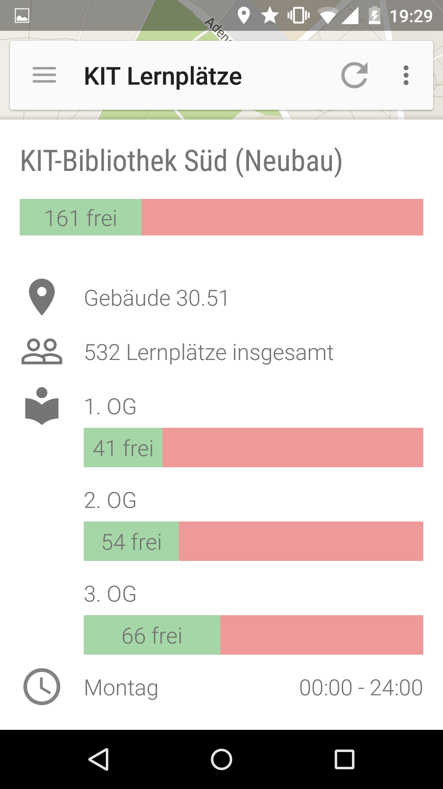
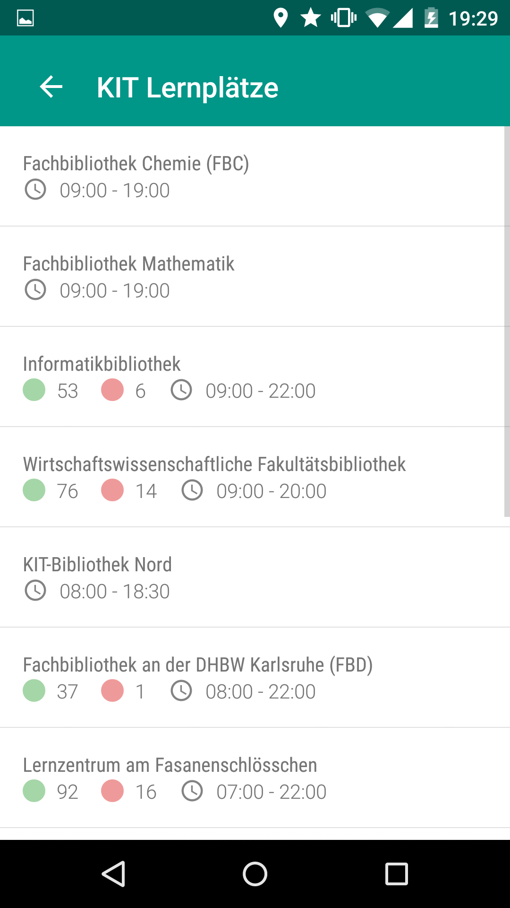

# Learning Spaces

An inofficial Android app, that displays available learning spaces on the Karlsruhe Institute of Technology campus. It queries the [official Learning Spaces data of the KIT library](http://www.bibliothek.kit.edu/cms/english/free-learning-places.php) and displays it in a mobile-friendly way.

All code is written in [Kotlin](http://kotlinlang.org/), making heavy use of the [Anko library](https://github.com/JetBrains/anko/). To get a quick overview, check out [MainActivity](app/src/main/java/de/maxvogler/learningspaces/activities/MainActivity.kt), [Fragments](app/src/main/java/de/maxvogler/learningspaces/fragments/), [Location](app/src/main/java/de/maxvogler/learningspaces/models/Location.kt) and [LocationService](app/src/main/java/de/maxvogler/learningspaces/services/LocationService.kt).

### License
> Learning Spaces
> 
> Copyright (C) 2015 Max Vogler
> 
> This program is free software; you can redistribute it and/or modify
> it under the terms of the GNU General Public License as published by
> the Free Software Foundation; either version 2 of the License, or
> (at your option) any later version.
> 
> This program is distributed in the hope that it will be useful,
> but WITHOUT ANY WARRANTY; without even the implied warranty of
> MERCHANTABILITY or FITNESS FOR A PARTICULAR PURPOSE.  See the
> GNU General Public License for more details.
> 
> You should have received a copy of the GNU General Public License along
> with this program; if not, write to the Free Software Foundation, Inc.,
> 51 Franklin Street, Fifth Floor, Boston, MA 02110-1301 USA.
